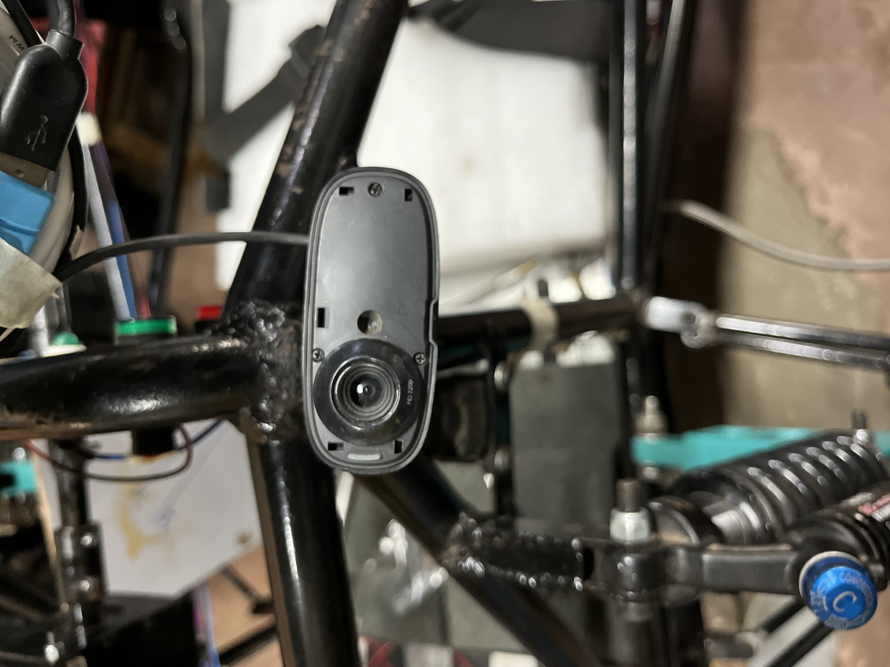

# F1 Car Collision & Nearby Object Detection

  

# Data Flow Diagram

# Real World Implementation 

  

## Introduction

Detect objects around car and estimate a distance to give warnings to the driver.

- Detect object using already pretrained models like YOLOv3, YOLOv4, YOLOv5, etc.
- Estimate distance to the object using camera calibration and object size.
- Give warnings to the driver using vibration motors on the steering wheel.

# Requirements

- F1 Car (We are using our college car for this project)
- Raspberry Pi 4
- Camera (We are using Logitech C270)
- Vibration Motors (We are using 2 vibration motors, Smaller ones works which will fit on the steering wheel using 3D printed parts)
- 3D Printer (Optional, if you want to print the parts for vibration motors)
- Wires and Motor Driver for raspberry pi (We are using L298N motor driver)
- and other stuffs like breadboard, jumper wires, etc.

# How to use
We will be specifyly updating this section soon for raspberry pi setup and code.

- Clone this repository
- Install requirements using `pip install -r requirements.txt`
- Run `python main.py`

# Project Flow Chart

# Collaborators

- Spark Racing Team - www.sparkracingteam.com